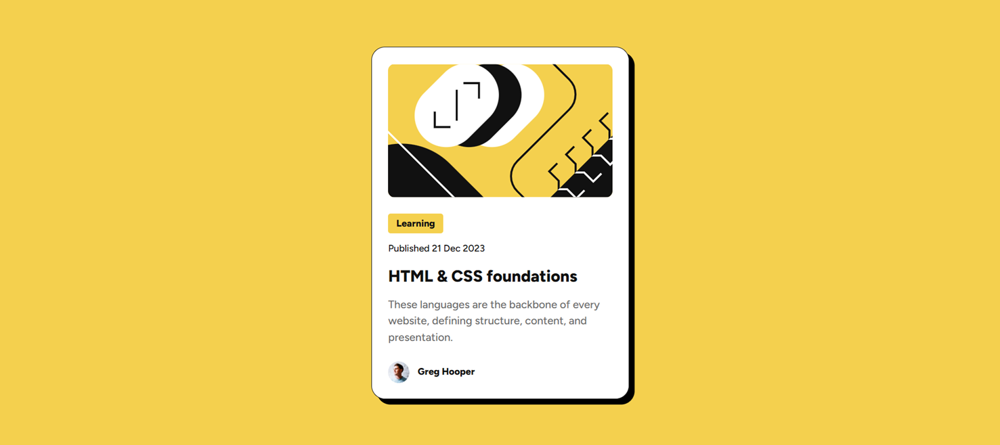
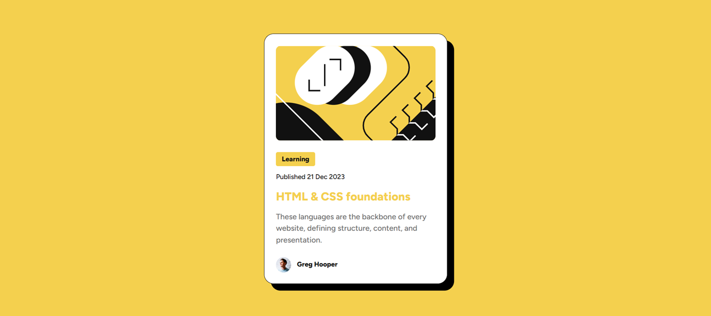
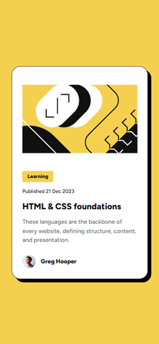
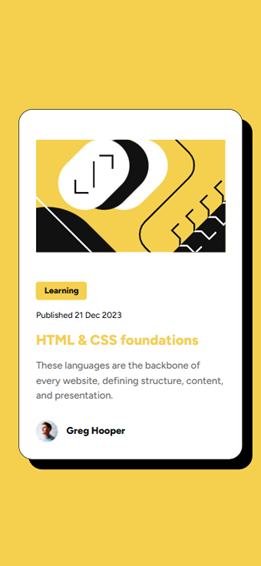

# Frontend Mentor - Blog preview card solution

This is a solution to the [Blog preview card challenge on Frontend Mentor](https://www.frontendmentor.io/challenges/blog-preview-card-ckPaj01IcS). Frontend Mentor challenges help you improve your coding skills by building realistic projects. 

## Table of contents

- [Overview](#overview)
  - [The challenge](#the-challenge)
  - [Screenshot](#screenshot)
  - [Links](#links)
- [My process](#my-process)
  - [Built with](#built-with)
  - [What I learned](#what-i-learned)
  - [Continued development](#continued-development)
  - [Useful resources](#useful-resources)
- [Author](#author)

## Overview

### The challenge

Users should be able to:

- See hover and focus states for all interactive elements on the page

### Screenshot

#### 1. Desktop version (1440px x 960px): 

Normal (passive state)



Hover/Active/Focus (hover state)



----

#### 2. Mobile version (375px x 812px):

Normal (passive state)



Hover/Active/Focus (hover state)



### Links

- Solution URL: [Repo](https://github.com/hopiun-frontend-practice/blog-preview-card.git)
- Live Site URL: [GitHub Pages](https://your-live-site-url.com)

## My process

### Built with

- Semantic HTML5 markup
- CSS custom properties for colors, spacing, and typography
- @font-face
- Flexbox
- Google Fonts
- @media queries

### What I learned

This was my second Frontend Mentor challenge, and I really enjoy the process of solving these tasks. They make me want to practice more, explore different layout techniques, and build more polished interfaces. During this project, I learned a lot of new things that were especially useful for improving the overall look and responsiveness of the page.

One of the new things for me was working with media queries, which I had not used before. I also learned how to use @font-face to load local fonts properly, and I became more comfortable with the :is(:hover, :active, :focus) selector for creating cleaner interactive states. I also refreshed my understanding of basic CSS transforms and how small visual details can make a component feel much more polished.

```css
@font-face {
    font-family: 'Figtree';
    src: url('./assets/fonts/static/Figtree-ExtraBold.ttf') format('truetype');
    font-weight: 800;
}

@font-face {
    font-family: 'Figtree';
    src: url('./assets/fonts/static/Figtree-Medium.ttf') format('truetype');
    font-weight: 500;
}
```

```css
.blog-card:is(:hover, :active, :focus) {
    box-shadow: 14px 14px 0px 0px rgba(0, 0, 0, 1);
}

.blog-card:is(:hover, :active, :focus) .blog__title {
    color: var(--yellow);
    cursor: pointer;
}
```

```css
@media (min-width: 37.5rem) {
  .blog-card {
        width: 32rem; 
        height: 50rem;
  }

  /* ... */
}
```

### Continued development

Going forward, I want to keep sharpening my ability to build modern, polished frontend components and interfaces, paying close attention to layout, spacing systems, and typography consistency.

Alongside this, I plan to deepen my JavaScript skills, focusing on core concepts like the DOM, fetch, and asynchronous programming (async/await, Promises), before moving on to more advanced topics as I grow more confident.

I'll keep building this out by working through challenges across different platforms, including further projects here on Frontend Mentor.

### Useful resources

- [How to host your own fonts made simple](https://youtu.be/KzqQXDbDvus?si=SVMp6LGkLCwbENmp) - This video helped me understand how to use `@font-face` to load local fonts properly and apply them in a project.
- [Tutorial: Learn how to use CSS Media Queries in less than 5 minutes](https://youtu.be/2KL-z9A56SQ?si=Kpv1OeU_RTRt6gRP) - This video helped me understand how media queries work and how to adapt layouts for different screen sizes.  

## Author

- Frontend Mentor - [@Hopiun](https://www.frontendmentor.io/profile/Hopiun)
- [LinkedIn](www.linkedin.com/in/dmytro-mkrtychan-208a1a358)
